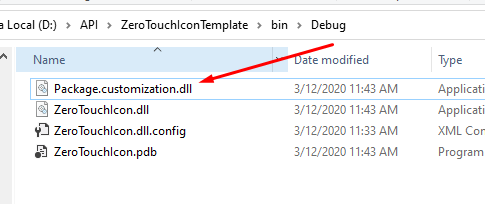

# ZeroTouchIconTemplate

### 1.Build Events and Start Action
```
xcopy /Y "$(TargetDir)*.*" "$(AppData)\Roaming\Dynamo\Dynamo Revit\2.1\packages\$(ProjectName)\bin\"

xcopy /Y "$(ProjectDir)pkg.json" "$(AppData)\Roaming\Dynamo\Dynamo Revit\2.1\packages\$(ProjectName)"

```
### 2.Location 


